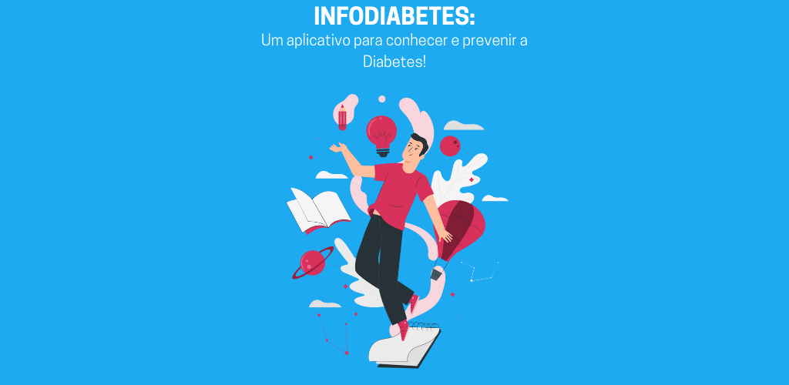

  

<h1 align="center">InfoDiabetes</h1>

    
    
  

 <a href="#grey_question-sobre"><b>Sobre o projeto</b></a> •
 <a href="#wrench-funções"><b>Funções</b></a> • 
 <a href="#rocket-tecnologias"><b>Tecnologias</b></a> • 
 <a href="#arrow_down_small-download"><b>Download</b></a>

 

<h1 align="center">
  
</h1>
  
## :grey_question: Sobre

É um aplicativo desenvolvido por três estudantes do ensino médio técnico no Instituto Federal do Rio Grande do Norte, como forma de construir um projeto para o TCC (Trabalho de conclusão de curso), o qual busca trazer informações acerca da Diabetes de forma leve e fácil de entender. Além das informações fornecidas, o aplicativo possui outras funções que o tornam mais interessante.

## :wrench: Funções

- [x] Aba Educativa;
- [x] Tabela de Indice glicêmico;
- [x] Jogo de Perguntas e Respostas;
- [x] Teste para fator de risco em ter diabetes.

## :rocket: Tecnologias

Para a elaboração da aplicação, foi utilizado: 
  
## :arrow_down_small: Download

Para realizar o download do aplicativo, basta clicar [aqui](https://play.google.com/store/apps/details?id=br.com.diabetesManagerApp).

  
<h4 align="center"> 
	✅  InfoDiabetes 🚀 Concluído ✅
</h4> 
